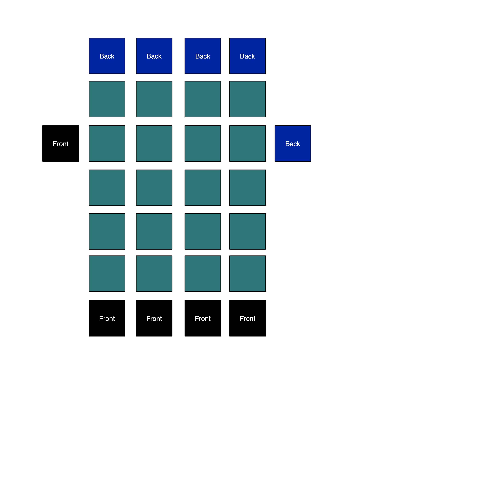

# Two-dimentional stack as a data storage.



You might hear about stack in low-level languages and stack-based languages like FORT. But that concept of the stack is pretty much linear. Stack is LIFO, or Last-In-First-Out linked list, where each element of the stack is a data item. This concept of stack didn't changed much since likely 60-th. And what's wrong with this time-tested concept ? Poor data isolation is one of the common issues with traditional stack. There is literally thousands and thousands examples of what went wrong when function incorrectly reaches for the data in the stack, creating stability, correctness and oftentimes security issues. The stack concept in BUND is different. Each element of the stack is a stack. So, every time, when you work with data stored in the stack, you are working not with globally accessible list of element, but with one of the many, separated data structures. And BUND offers you all basic primitives to control that two-dimensioned world. You can rotate data stack or global stack, you can duplicate and drop data, you can create new stacks and drop existing ones and you can name and position data stacks.

## Placing data on the stack.

How to place data on the stack ? It is simple, just declare them:

```
42            /* Placing number 42 on stack */
#TRUE         /* then place a boolean true */
3.14          /* then store float 3.14 */
'Hello world!' /* and here is the string */
```
Last element that you declare, will be the one in the front of the stack

## What else you can place on the stack ?

```
{answer:42}
```
Another data type supported by the BUND which you can implicitly declare and store in the stack is a map structure. As in many languages, it is looks like _key_ and _value_ pairs, separated by the _:_ and enclosed in curly braces.

```
{answer:42 msg: \"Hello world!\" pi:3.14 truth:#TRUE} json
```

Here, you are declaring the map, and then converting map to a JSON object. JSON data type is native in the BUND and you can query it through the _CALL interface_. Example:

```
{answer:42 msg: \"Hello world!\" pi:3.14 truth:#TRUE} json answer
```

This code snippet will return 42 and place it on the stack. BUND also supported float-number two-dimesional matrix data-type.

```
M[2 3]
```

This will create matrix with two columns and three rows and place it on the stack.

```
set
```
And finally, this operator will create an empty set and place it on the stack.

## Lambda function

```
lambda\ BUND code goes here \
```

This code will create a nameless lambda function and place the reference to that function on the top of the stack.

## Stack manipulations

All stack languages, like FORT provides you with ability to control the stack. BUND is no exception. Although, you have to remember, BUND's stack is two-dimensional structure, the stack of stacks. So, the context of "manipulation" is important to remember.

### Creating new "anonymous" or named stacks

Operator "|" - the pipe will create a new anonymous stack

```
3 2 1 /* Goes to one stack */ | 6 5 4 /* Goes to another stack */
```
In this example, the stack containing 4 5 6 is the current (and the last) one. Another way of defining a new stack is to enclose data in the braces.

```
3 2 1 ( 6 5 4 ) 9 8 7
```
In this example, we defined three stacks, one with numbers 1 2 3, second with 4 5 6 and third with 7 8 9. In previous examples all stacks was anonymous. You can only refer to them by they position in the "stack-of-stacks". But BUND allow you to define a named stacks and then refer to them by name.

```
:answer(42) :test(1 2 3)
```
In this example, we defined two named - "answer" and "test" and one anonymous stacks. When we are closing the _)_ of stack with 3 2 1, new anonymous stack is created.

### Pushing data out of current stack

Operator _ or "underscore" will return data from current stack to a previous stack.

```
3 2 1 ( 42 _ )
```
The 42 will be taken from the top of separate stack and placed on the top of the previous stack. You can use parameters too:

```
( _[42] )
```
Here the number will be taken from the parameters and pushed outside of the stack.

### Rotating global stack

The context for those operators is to manipulation with "stack-of_stacks"

```
1 2 3 | 42 | 4 5 <-
```
The stack with value 42 now will be the current one. Operator _<-_ will rotate the global stack left

```
42 | 1 2 3 | 4 5 ->
```
Operator _->_ will rotate the global stack to the right and stack with value 42 will be the current one.

### Rotating data in the stack

```
1 42 2 <<
```
This code snippet rotates the current stack to the left and place number 42 to the top of the current stack.

```
1 2 42 <<[2 1]
```
You can pass the number of stack rotations as parameters to the rotate function. In this example, the stack will be rotated two times, then one time.

```
42 1 2 >>
```
In this example, stack will be rotated one time to the right.

### What else you can do with data on the stack ?

You can drop last value

```
3 42 1 ,
```
In this example, BUND will drop number _1_ from the stack and 42 will be on top.

You can use operators _dup_ or _^_ to duplicate last item on the stack

```
1 2 3 ^
```
After executing that, stack will look like _[1 2 3 3]_

### Playing with stack-of-stacks

Do you want to drop the current stack ? Sure, operator _;_ will do that for you.

```
42 | 1 2 3 ;
```
In tis example we dropping stack containing 3 2 1 and stack with value 42 will be the current one. Also, you can pass the name of the stack as parameter and operator _;_ will drop that stack

```
(42) :test(1 2 3) ;['test']
```
Again, stack with number 42 is the current one. And to position named stack, we can use function _S[]_ passing the name of the stack as parameter.

```
:answer(42) :test(1 2 3) S['answer']
```
In this example, BUND will rotate stacks and position one with name *answer* as current.
